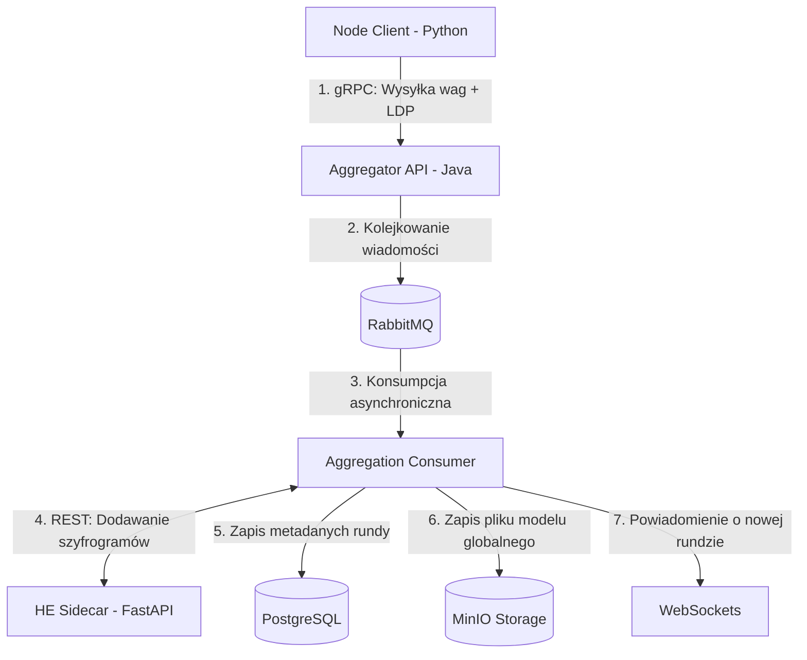
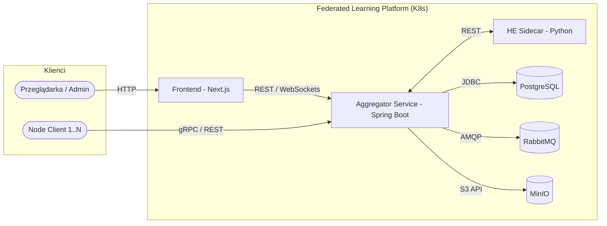

# Federated-Learning-Platform
## Schemat przepływu danych (Data Flow Diagram)

```mermaid
graph TD
    NC[Node Client - Python] -->|1. gRPC: Wysyłka wag + LDP| AGG[Aggregator API - Java]
    AGG -->|2. Kolejkowanie wiadomości| RMQ[(RabbitMQ)]
    RMQ -->|3. Konsumpcja asynchroniczna| CONS[Aggregation Consumer]
    CONS <-->|4. REST: Dodawanie szyfrogramów| HE[HE Sidecar - FastAPI]
    CONS -->|5. Zapis metadanych rundy| DB[(PostgreSQL)]
    CONS -->|6. Zapis pliku modelu globalnego| MINIO[(MinIO Storage)]
    CONS -->|7. Powiadomienie o nowej rundzie| WS[WebSockets]
```

## Diagram Architektury C4 (Poziom Kontenerów)

```mermaid
graph LR
    subgraph Klienci
        UI([Przeglądarka / Admin])
        NODE([Node Client 1..N])
    end

    subgraph "Federated Learning Platform (K8s)"
        FE[Frontend - Next.js]
        AGG[Aggregator Service - Spring Boot]
        HE[HE Sidecar - Python]
        
        DB[(PostgreSQL)]
        RMQ[(RabbitMQ)]
        MINIO[(MinIO)]
    end

    UI -->|HTTP| FE
    FE -->|REST / WebSockets| AGG
    NODE -->|gRPC / REST| AGG
    AGG <-->|REST| HE
    AGG -->|JDBC| DB
    AGG -->|AMQP| RMQ
    AGG -->|S3 API| MINIO
```
